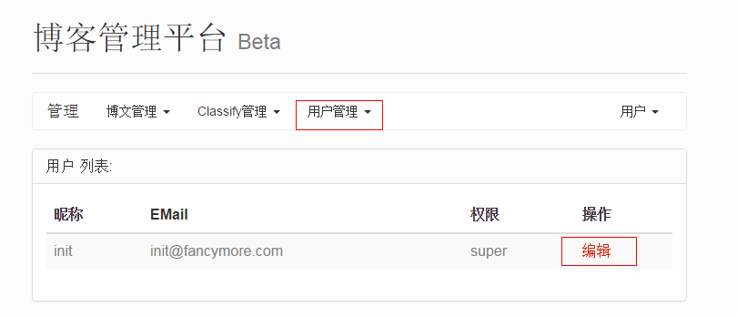
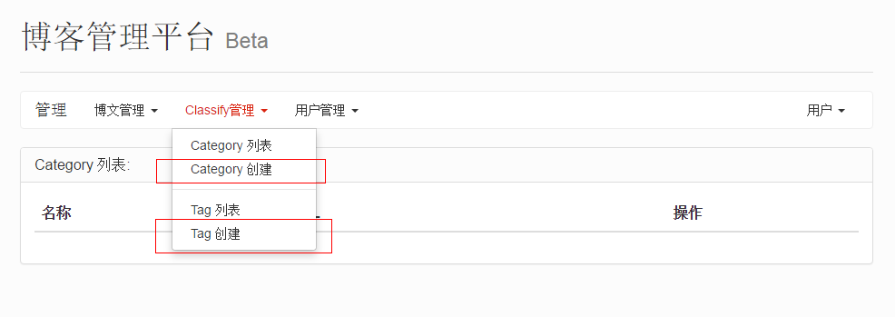
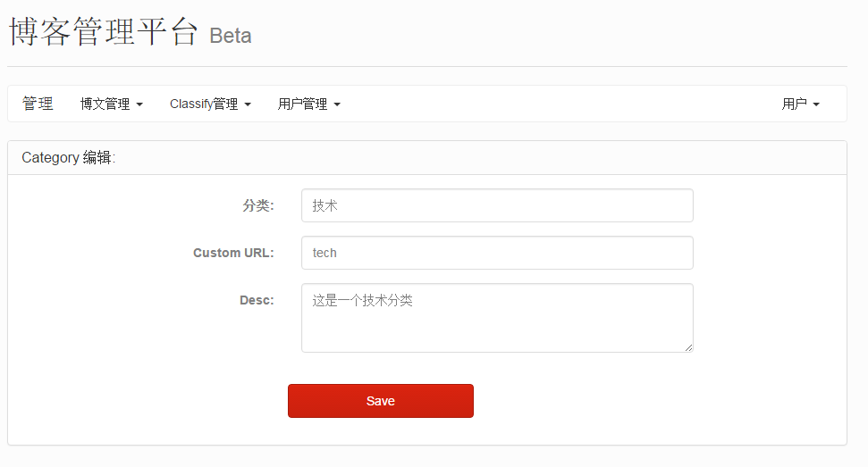
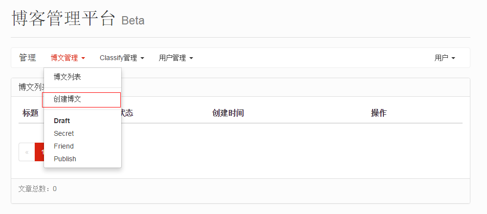
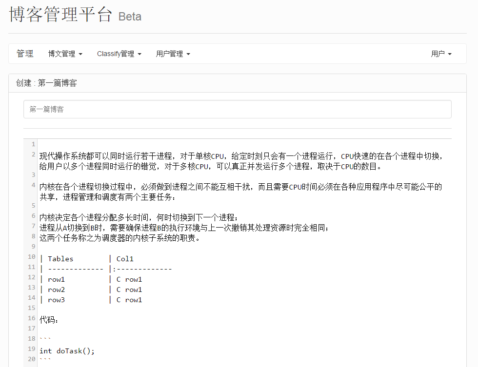
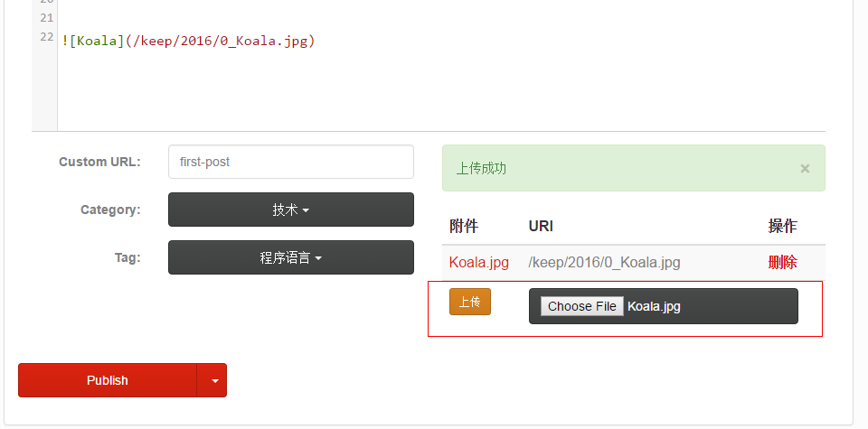

# 基本说明

博客系统`keeper`使用以下技术实现：

* Bootstrap
* Angularjs
* Beego(Golang)

评论系统使用 [多说](http://duoshuo.com/)。

博客示例可访问我的个人主页：[fancymore.com](http://fancymore.com)

# 构建

## 编译

下载源码后在源码路径执行:
```
go build keeper.go
```
会生成可执行文件`keeper`。

## 配置

打开 conf/app.conf 配置博客信息，根据例子配置网站的地址，本地监听端口，以及多看评论系统。

## 初始化

创建数据库：

```
./keeper orm syncdb -force=true -v
```

初始化第一个用户，方便能登陆：

```
./keeper initdb
```

## 登录

第一次登录需要使用`initdb`后的默认用户，`keeper` 使用一次性密码登录，需要使用类似`Google-Authenticator`的工具扫下面的二维码：


或者手工输入secret：MVRGEMTGMI4GEZDEHBTDSZJXHE3WIZBVMY3TENJQMQZTIN3GGVSA====

用户名：init@fancymore.com
密码：6位的一次性密码

## 修改用户

刚才登录的用户为初始用户，登陆后需要修改默认用户名和邮箱，并重置密码。



# 开始第一篇博客

## TAG 和 Category

创建博客之前需要先创建一个TAG和分类：



分别填写分类名称和介绍，其中介绍可以使用markdown语法，CustomURL自定义URL KEY：



添加完成之后，需要添加主页默认显示的Category是哪个：

```
# file: conf/app.conf
SiteDefaultCategory = "tech"
```

## 添加文章

创建文章：



写入文章内容，markdown语法：



另外可以上传图片或者其他文件：


